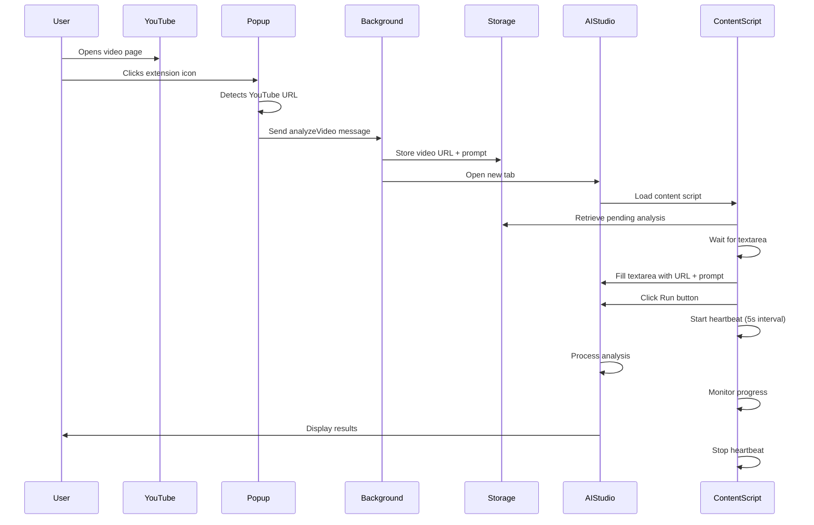

## Component Interaction

```
┌─────────────────────────────────────────────────────────────┐
│                        Chrome Browser                        │
├─────────────────────────────────────────────────────────────┤
│                                                               │
│  ┌──────────────┐         ┌──────────────┐                  │
│  │   YouTube    │         │  AI Studio   │                  │
│  │     Tab      │         │     Tab      │                  │
│  └──────┬───────┘         └──────┬───────┘                  │
│         │                        │                           │
│         │                        │                           │
│  ┌──────▼───────┐         ┌──────▼───────┐                  │
│  │    Popup     │         │   Content    │                  │
│  │   (UI/UX)    │         │   Script     │                  │
│  └──────┬───────┘         └──────┬───────┘                  │
│         │                        │                           │
│         └────────┬───────────────┘                           │
│                  │                                           │
│           ┌──────▼───────┐                                   │
│           │  Background  │                                   │
│           │    Worker    │                                   │
│           └──────┬───────┘                                   │
│                  │                                           │
│           ┌──────▼───────┐                                   │
│           │   Storage    │                                   │
│           │     API      │                                   │
│           └──────────────┘                                   │
│                                                               │
└─────────────────────────────────────────────────────────────┘
```

## Data Flow

```
1. User Action
   └─> Popup detects YouTube URL
       └─> Sends message to Background

2. Background Processing
   └─> Stores analysis data in chrome.storage
       └─> Opens AI Studio tab

3. Content Script Activation
   └─> Retrieves stored data
       └─> Waits for page load
           └─> Fills textarea
               └─> Clicks Run button
                   └─> Starts heartbeat

4. Heartbeat Loop
   └─> Every 5 seconds:
       └─> Check if analysis running
           └─> Simulate user activity
               └─> Stop when complete
```

## State Machine

```
┌─────────┐
│  IDLE   │
└────┬────┘
     │ User clicks extension
     ▼
┌─────────┐
│ PENDING │ (Data stored)
└────┬────┘
     │ Tab opens
     ▼
┌─────────┐
│ LOADING │ (Content script loads)
└────┬────┘
     │ Textarea found
     ▼
┌─────────┐
│ FILLING │ (Inserting prompt)
└────┬────┘
     │ Run button clicked
     ▼
┌─────────┐
│ RUNNING │ (Heartbeat active)
└────┬────┘
     │ Analysis complete
     ▼
┌─────────┐
│  DONE   │
└─────────┘
```
